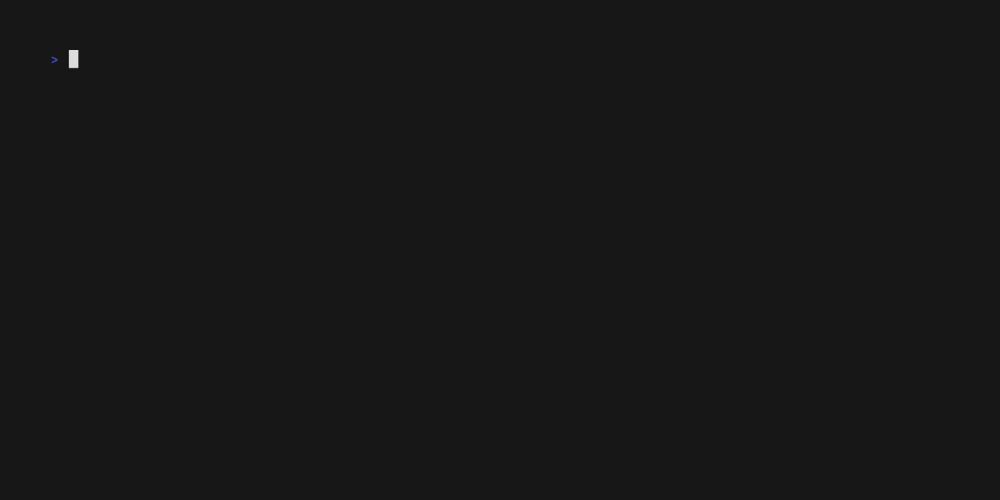

✨**doxxer**✨ is an extremely configurable CLI tool written in *Rust* that
simplifies and automates dynamic [SemVer](https://semver.org/) versioning by
leveraging the latest Git tags and commits.

It includes tag filtering, output version prefexes, many version bumping mechanisms
and is the perfect tool to generate dynamic version on the fly. No more project 
programming language specific solution to handle this!

This approach was heavily inspired by the output produced by the native
`git decribe --tags`, which was my own de-facto soltuin for dynamic versioning of
software projects.



# Introduction

## Getting started

You can currenly install the tool locally via *cargo*:

```bash
cargo install doxxer
```

## Usage

The tool has 2 main commands to work with your repository: `current` and `next`.

```bash
doxxer help
```

```bash
Dynamic version manager for Git

Usage: doxxer [OPTIONS] <COMMAND>

Commands:
  current  Get current version
  next     Get next version
           If no strategy is provided, falls back to dynamic version template "{pre}.{identifier}.{distance}" with "identifier=dev"
  help     Print this message or the help of the given subcommand(s)

Options:
  -d, --directory <DIRECTORY>  Path to the Git repository [default: .]
  -h, --help                   Print help
  -V, --version                Print version

Filter options:
  -f, --filter-prefix <FILTER_PREFIX>  Prefix of the tags used for current version detection [default: v]

Output options:
  -o, --output-prefix <OUTPUT_PREFIX>  Add prefix to the output version [default: v]
```

## Current version


```
doxxer current --help
```

```bash
Get current version

Usage: doxxer current [OPTIONS]

Options:
  -f, --field <FIELD>  Field/part of the version [possible values: major, minor, patch, pre, build]
  -h, --help           Print help
```

## Next version

```
doxxer next --help
```

```bash
Get next version
If no strategy is provided, falls back to dynamic version template "{pre}.{identifier}.{distance}" with "identifier=dev"

Usage: doxxer next [OPTIONS] [STRATEGY]

Bumping strategy:
  major       Major version
  minor       Minor version
  patch       Patch version
  prerelease  Pre-release version
  pre-major   Major + pre-release version
  pre-minor   Minor + pre-release version
  pre-patch   Patch + pre-release version
  help        Print this message or the help of the given subcommand(s)

Options:
  -f, --field <FIELD>  Field/part of the version [possible values: major, minor, patch, pre, build]
  -h, --help           Print help
```

Default behaviour of the `next` command is ideal for generating development versions dynamically, as it appends `dev.{distance}+{hash}` to the latest version.

## Template variables

| Variable | Description |
|--|--|
| `{pre}` | Current pre-release |
| `{identifier}` | Name of the pre-release identifier |
| `{inc}` | Next version for specified `{identifier}` |
| `{hash}` | First 7-digits of the commit hash |
| `{distance}` | Count of commits since last tag |

# Docker

There is a docker image based on latest `alpine` image and published on GitHub's containter registry: `ghcr.io/karlis-vagalis/doxxer`

## Settings

The default workspace directory inside the container is `/repo`.

The entrypoint is `doxxer`.


## Examples

To execute `doxxer next` command once, you could run:

```bash
docker run --rm -v .:/repo -it ghcr.io/karlis-vagalis/doxxer:latest doxxer next
```

where, we mount current (`.`) directory inside the container and execute `next` subcommand.

## As base image

If you want to include *doxxer* binary inside your custom docker image, you can copy the binary like so:

```dockerfile
FROM ghcr.io/karlis-vagalis/doxxer:latest AS base
...
COPY --from=base /bin/doxxer /bin
...
```

where we copy the binary to the `/bin` folder in our new image.

# FAQ

1. Why is does the default strategy for `next` appends second pre-release?

Because the original idea and goal of this tool is to dynamically generate version
for a project, when iterating/developing. So, the defaults reflect this goal and
thus, require least amount of configuration.

2. Why is the project called `doxxer`?

Because it's like somebody who [doxes](https://en.wikipedia.org/wiki/Doxing), by
exposing the version information about Git repo to you! It the name really fitting? Maybe no. It's just a name.

3. Why rust?

To learn the language and Rust offers excellent support for creating binary CLI tools
using `clap`.

# Roadmap

- [ ] Add installation shell script, similar to `uv` or `just` to install prebuild binaries from GitHub
- [ ] Add `{timestamp}` variable support to the template
